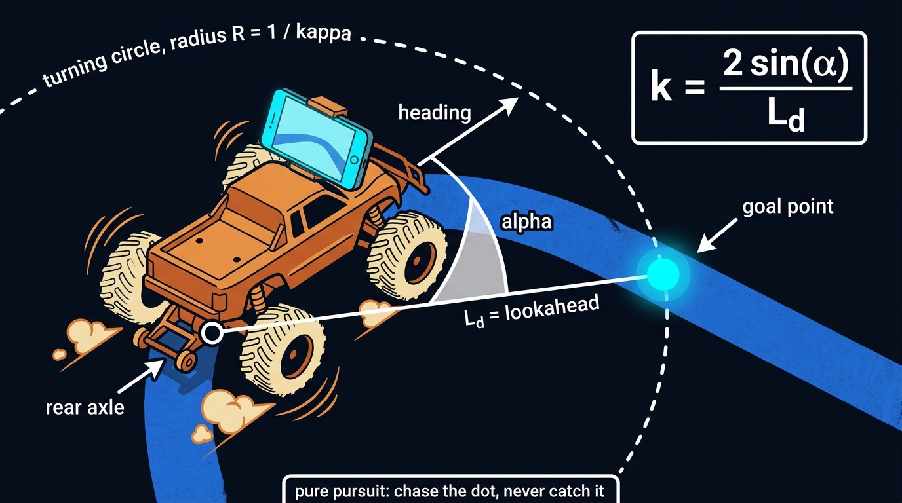

# robo-bump-truck-ros

**Drive the [Robo Bump Truck](https://vaguebutexciting.dev/posts/kitchen-robot-eyes-log1/) from any lane- or trail-following model.**
This repo is the ROS 2 interface to the truck: the message a model publishes, and the bridge node that turns it into a
steering and throttle request for the truck's flight controller. Your model stays in your repo; you depend on this one.

The truck is an RC Traxxas Stampede 2WD with a Jetson Orin Nano, a Pixhawk 6C Mini running ArduPilot Rover, and an iPhone
as the camera ([Robot Eyes](https://github.com/12mv2/robot-eyes) records and streams it). It has steered itself on a real
trail from the phone's camera. Everything here is the seam between a perception model and that vehicle.

## The contract

A model publishes one topic, **`control_cmd`**, at ~10 Hz. The message is **`control_interfaces/msg/ControlMsg`**:

```
# 1/m
float32 desired_curvature

# m/s
float32 desired_speed

bool listen_to_steering
bool listen_to_speed
```

| field | meaning | convention |
|---|---|---|
| `desired_curvature` | requested path curvature, 1/m | **positive = LEFT.** The model computes it as `κ = 2·Y/L²` in the standard ROS vehicle frame (X forward, **Y left**, Z up, on the ground under the rear axle), so a goal point to the left is positive |
| `desired_speed` | requested forward speed, m/s | the truck may cap it; today the human keeps the throttle |
| `listen_to_steering` | the curvature is valid this cycle | **`false` = "I do not see a lane"** |
| `listen_to_speed` | the speed field is valid this cycle | |

**There is no `header`.** The message carries no stamp and no frame id: it is a command for *now*, published every cycle, and
a subscriber that has not heard for one period should treat that as a dropout rather than reasoning about staleness from a stamp.

**No-lane behaviour is a safety contract, not a detail.** Publishing nothing means the bridge holds the last command and the
truck keeps turning into whatever made the model lose the lane; publishing zero curvature means it straightens and drives off
the trail. So the model always publishes, and says so with the flag. Agreed behaviour on both sides, and what the model side's
node actually does once the lane has been missing for several consecutive frames:

| | `desired_curvature` | `desired_speed` | `listen_to_steering` | `listen_to_speed` |
|---|---|---|---|---|
| lane seen | the computed curvature | the configured speed | `true` | `true` |
| **no lane** | **the last valid curvature, held for reference** | **0** | **`false`** | `true` |

So the bridge stops the vehicle and hands steering back to the human; it does not act on the held curvature.

## What the bridge does with it



*The truck's own controller is pure pursuit: pick the goal point a lookahead distance ahead on the trail and command the curvature of the circle
through it. A model that publishes curvature is speaking the same language.*


`truck_bridge/` turns the request into what ArduPilot Rover accepts today: an RC override on the steering channel while the
vehicle is in MANUAL. Steering angle `δ = atan(L·κ)` with wheelbase `L = 0.269 m`, mapped to the servo's calibrated PWM.
On the truck **positive PWM = left** and the truck's own tools use **positive κ = right**, so the bridge negates once, here,
and the wire convention above wins.

Safety model, all enforced by the flight controller and the radio, none by this node:
- the radio's 3-position switch: **out = model steers · middle = blend with the human's wheel · toward the driver = HOLD**;
- a kill knob that stops the motor regardless of anything on the Orin;
- `RC_OVERRIDE_TIME 3 s`: if the bridge stops publishing, steering returns to the radio within three seconds;
- throttle stays on the human's trigger until the truck earns otherwise.

A configured failsafe is not a demonstrated failsafe. Every one of these has been induced on the bench and watched.

## Layout

```
control_interfaces/     the message package (colcon; authored by the model side, committed verbatim — never retyped)
truck_bridge/           the bridge node: control_cmd → the truck's existing kappa→servo path (MAVLink RC override today; MAVROS later)
examples/               the model side's publish/listen examples, verbatim
docs/                   calibration (camera → vehicle frame), the seam sign convention, the seam diagram, field notes
```

**One repo.** The model never lives here: it runs on the truck's Orin as a Docker image (arm64; Jazzy inside a 24.04 container on
the Humble host) and only its message and examples are committed. There is nothing for vcstool to assemble.

## Distros

The truck's Orin is JetPack 6 = Ubuntu 22.04 = **ROS 2 Humble** natively. A Jazzy model runs in a 24.04 container on it.
The message package builds on both.

## Status

Interface repo, cut 2026-09-08. **The contract above is transcribed from the model side's own `ControlMsg.msg` and runtime node
(read 2026-09-13); the message package itself is not committed here yet.** The bridge node follows. Nothing here is claimed until
it has driven the truck: **not tested, therefore not claimed.**

---
Colin Rooney · [ROONEY Tech](https://rooneytech.com) · © 2026 Rooney Industries LLC · MIT.
Build log: [vaguebutexciting.dev](https://vaguebutexciting.dev) · [YouTube](https://www.youtube.com/@cprooney).
